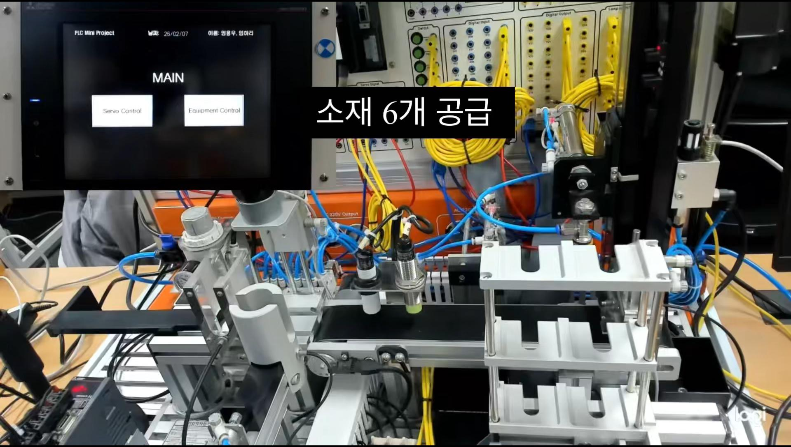
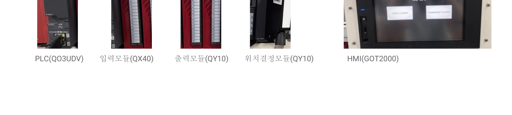
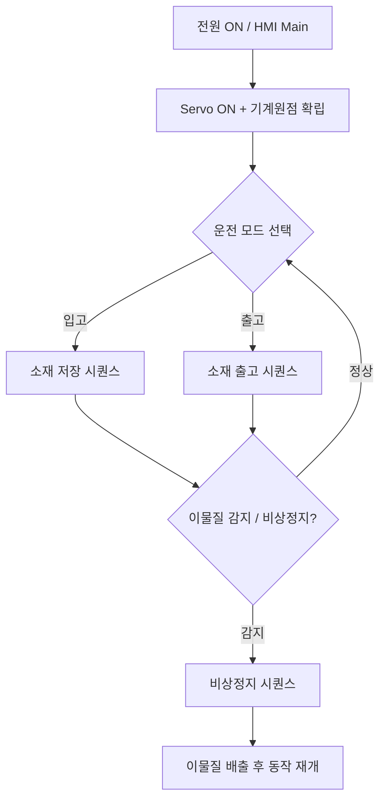
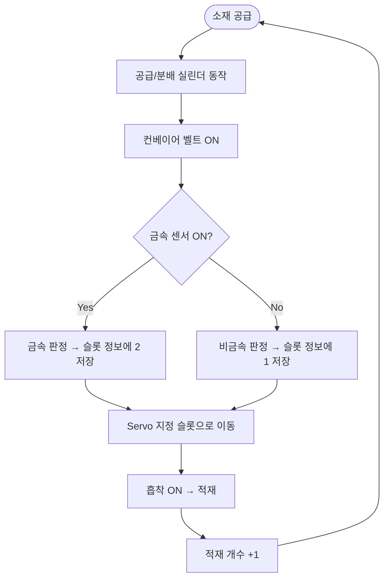
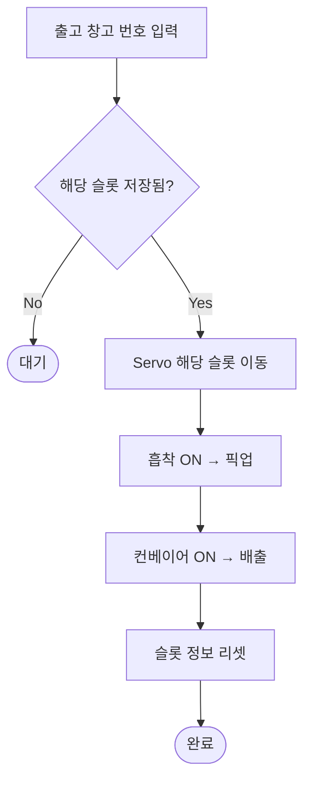
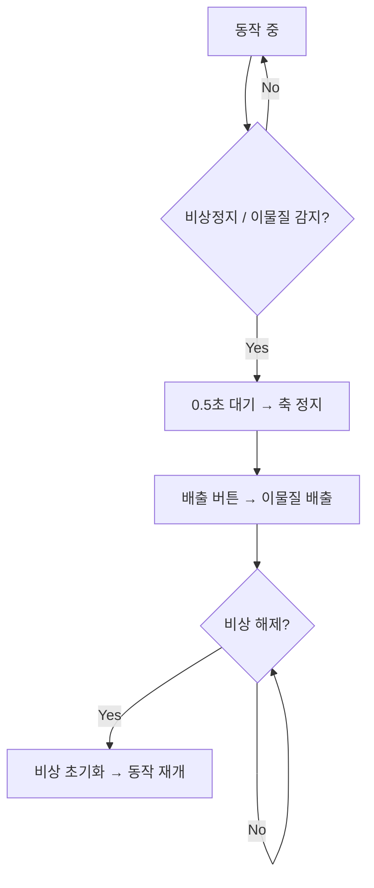
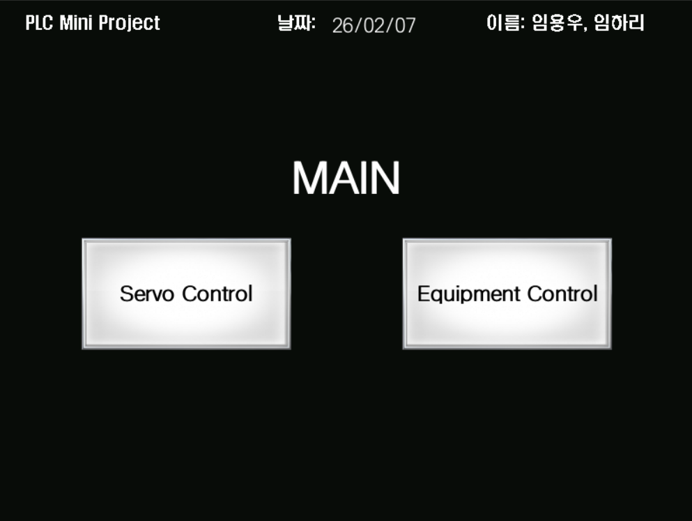
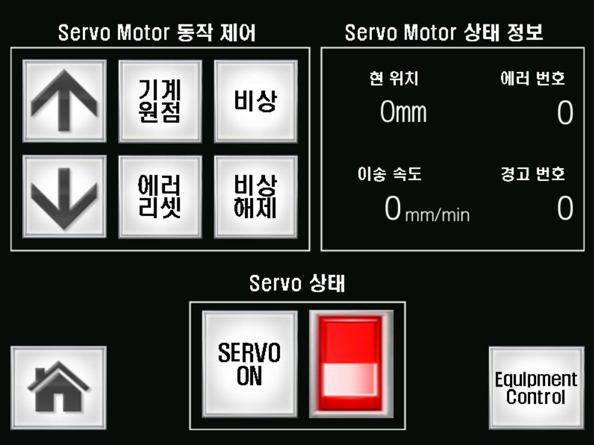
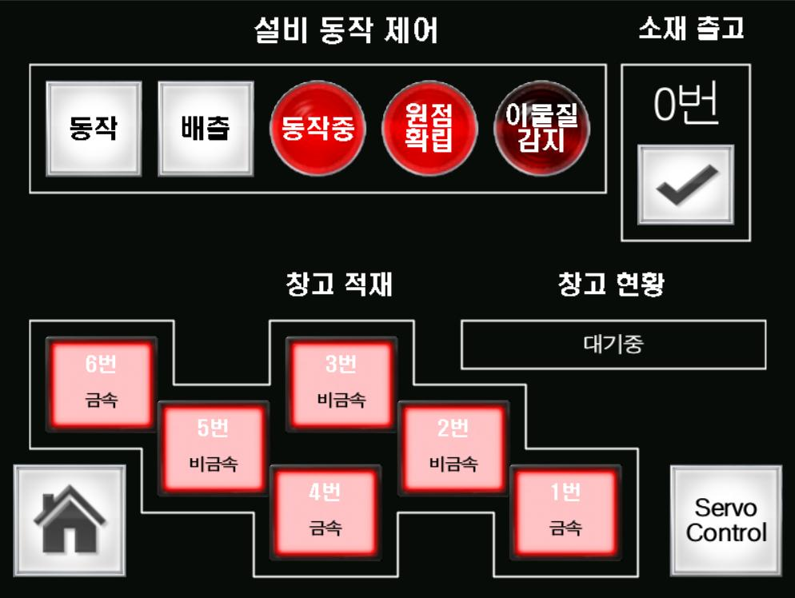

# 🏭 자동화 창고 적재 시스템 (Automated Warehouse Storage System)

> **Mitsubishi Q-series PLC 기반 금속/비금속 소재 자동 분류·적재·출고 시스템**  
> AI융합 로봇S/W 2기 · 2인 팀 공동 개발 · 2026.02

<!-- 시연 영상 썸네일을 넣고 유튜브 링크를 연결하세요 -->

---

## 📌 프로젝트 개요

작업자의 개입 없이 **입고 → 분류 → 적재 → 출고** 전 과정을 자동화한 스마트 창고 시스템입니다.
소재를 금속/비금속으로 자동 판별하여 6개 슬롯에 적재하고, HMI에서 창고 현황을 실시간
모니터링하며 원하는 소재를 번호 지정으로 출고할 수 있습니다.

| 항목 | 내용 |
|------|------|
| **기간** | 2026.02 |
| **팀 구성** | 2인 (공동 개발 — 전 과정 참여) |
| **개발 환경** | GX Works2 (PLC 래더), GT Designer3 (HMI) |
| **제어 대상** | 서보 위치결정, 공압 실린더, 컨베이어, 흡착 패드 |

---

## 🎯 설계 목표

**1. 완전 자동화**
- 작업자 개입 없이 입고–적재–출고 전 과정 자동 운전
- HMI를 통한 창고 현황 및 설비 상태 실시간 모니터링

**2. 안전성 확보**
- 센서 기반 충돌 방지 및 동작 인터락(interlock) 로직
- 이물질 감지 및 비상 정지 기능
- 오작동 방지 로직

---

## 🛠️ 하드웨어 구성

| 구분 | 모델 | 역할 |
|------|------|------|
| CPU | **Q03UDVCPU** | 메인 제어 |
| 입력 모듈 | **QX40** | 센서/버튼 입력 |
| 출력 모듈 | **QY10** | 실린더/램프 출력 |
| 위치결정 모듈 | **QD75 계열** ⚠️ | 서보 위치 제어 (`ZP.PSTRT1`) |
| HMI | **GOT2000** | 터치 인터페이스 |

> ⚠️ 위치결정 모듈 정확한 모델명은 실물 확인 후 기입 (QY10은 출력 모듈이므로, `ZP.PSTRT1` 명령을 사용한다면 QD75 계열일 가능성이 높음)

---

## 🗺️ 시스템 아키텍처

---

## ⚙️ 주요 기능

### 1. 창고 빈자리 탐색
슬롯 6칸의 저장 상태 플래그(`M391`~`M396`)와 적재 개수(`D500`)를 확인해 빈 슬롯을 자동 탐색합니다. 모든 슬롯이 차면 `M397`(창고 가득참)로 입고를 차단합니다.

### 2. 금속 / 비금속 판별 및 적재
용량 센서로 소재 재질을 판별하여 슬롯별 소재 정보(`D591`~`D596`)에 저장합니다. (`1` = 비금속, `2` = 금속)

### 3. 번호 지정 출고
HMI에서 출고할 창고 번호(`D350`)를 입력하면 해당 슬롯의 저장 여부를 판별하고, 서보를 이동시켜 소재를 픽업 → 컨베이어로 배출 → 슬롯 정보를 리셋합니다.

### 4. 이물질 감지 및 비상정지
용량 센서(`X11`)로 컨베이어 상 이물질을 감지하거나 HMI 비상 버튼 입력 시, 조건 분기(`CJ P1`)로 즉시 비상 루틴에 진입합니다. 축 정지(`Y74`) 후 이물질을 배출하고, 비상 해제 시 중단 지점부터 동작을 재개합니다.

---

## 🖥️ HMI 화면 구성 (GOT2000)

| 화면 | 구성 |
|------|------|
| **Main** | Servo Control / Equipment Control 진입 버튼 |
| **Servo Control** | 서보 ON, 기계원점, 수동 조작(상/하), 에러 리셋, 비상/비상해제, 현재 위치·이송 속도·에러/경고 번호 표시 |
| **Equipment Control** | 동작/배출 버튼, 동작중·원점확립·이물질감지 램프, 창고 적재 현황(6슬롯 금속/비금속), 소재 출고 |

<!-- 스크린샷 3장을 docs/images/ 에 넣고 아래 경로를 맞추세요 -->
| Main | Servo Control | Equipment Control |
|:---:|:---:|:---:|
|  |  |  |

---

## 🧠 제어 로직 & 메모리 맵

> 실제 GX Works2 프로젝트 기준으로 검증 후 보완하세요. (래더 주석 기반 정리)

**Data Register (D)**
| 디바이스 | 용도 |
|---|---|
| `D350` | 출고 창고 번호 |
| `D351` | 창고 번호 인덱스 (번호 − 1) |
| `D500` | 현재 적재 개수 |
| `D591`~`D596` | 슬롯 1~6 소재 정보 (1=비금속, 2=금속) |
| `D597` | 창고 이동 상태 |

**Internal Relay (M)**
| 디바이스 | 용도 |
|---|---|
| `M300` | 동작 ON |
| `M391`~`M396` | 슬롯 1~6 저장중 플래그 |
| `M397` | 창고 가득참 |
| `M483` / `M484` | 비금속 / 금속 판정 |
| `M4900` / `M4901` | 정지 / 비상정지 |
| `M2006` | 비상 해제 |

**I/O & 위치결정**
| 디바이스 | 용도 |
|---|---|
| `X11` | 용량 센서 (이물질/금속 감지) |
| `X6` / `X7` | 배출 위치 후진 / 전진 |
| `Y74` | 축 정지 |
| `ZP.PSTRT1 (U7)` | 위치결정 모듈 서보 기동 |

---

## 🛡️ 안전 설계

- **동작 인터락**: 원점 확립·서보 ON 조건을 만족해야 동작 버튼 활성화
- **비상 정지**: HMI 비상 버튼 또는 이물질 감지 시 `CJ` 조건 분기로 즉시 라인 정지
- **충돌 방지**: 센서 기반 위치 확인 후 다음 스텝 진행
- **복구 시퀀스**: 비상 해제 시 중단 지점부터 안전하게 동작 재개

---

## 🎬 시연 영상

6개 소재 연속 공급 → 금속/비금속 자동 분류 적재 → 번호 지정 출고 → 이물질 감지 비상정지까지 전 과정을 확인할 수 있습니다.

---

## 📝 트러블슈팅 / 회고

<!-- 면접관이 가장 파고드는 부분입니다. 직접 해결한 문제를 1~3개 구체적으로 적으세요. -->
<!-- 예시 형식:
### 문제: [무엇이 문제였나]
- 증상 / 원인 분석
- 해결 방법
- 배운 점
-->

- (작성 예정)
